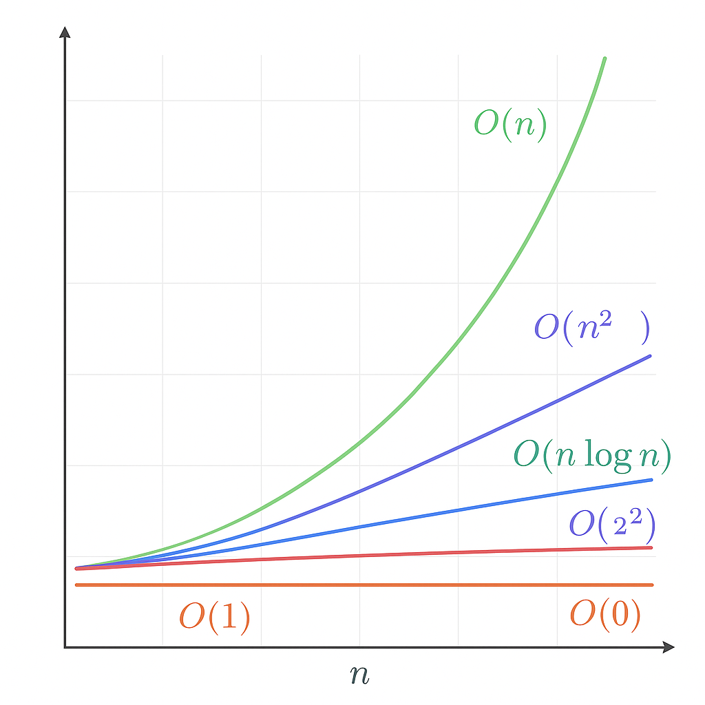

# DSA Notes - Complexity

## 1. Big-O Notation
- Describes the **upper bound** of an algorithm.
- Focuses on **worst-case**.
- Ignores constants and lower-order terms.

## 2. Common Time Complexities
| Complexity | Example |
|------------|---------|
| O(1) | Access array element |
| O(log n) | Binary search |
| O(n) | Traverse array |
| O(n log n) | Merge Sort |
| O(n^2) | Bubble Sort |
| O(2^n) | Recursive Fibonacci |
| O(n!) | TSP brute force |




## 3. Space Complexity
- Measures **extra memory used**.
- Iterative → usually O(1)
- Recursive → includes recursion stack

## 4. Examples in Python
```python
# O(1)
def get_first_element(arr):
    return arr[0]

# O(n)
def find_max(arr):
    max_val = arr[0]
    for num in arr:
        if num > max_val:
            max_val = num
    return max_val

# O(n^2)
def bubble_sort(arr):
    n = len(arr)
    for i in range(n):
        for j in range(0, n-i-1):
            if arr[j] > arr[j+1]:
                arr[j], arr[j+1] = arr[j+1], arr[j]
